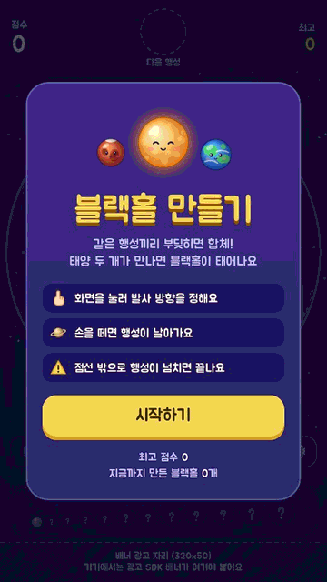
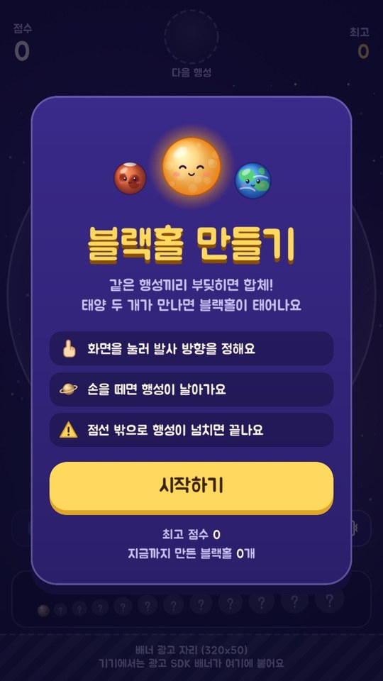
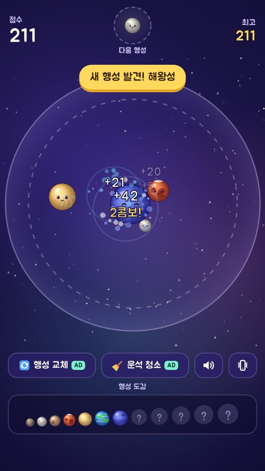
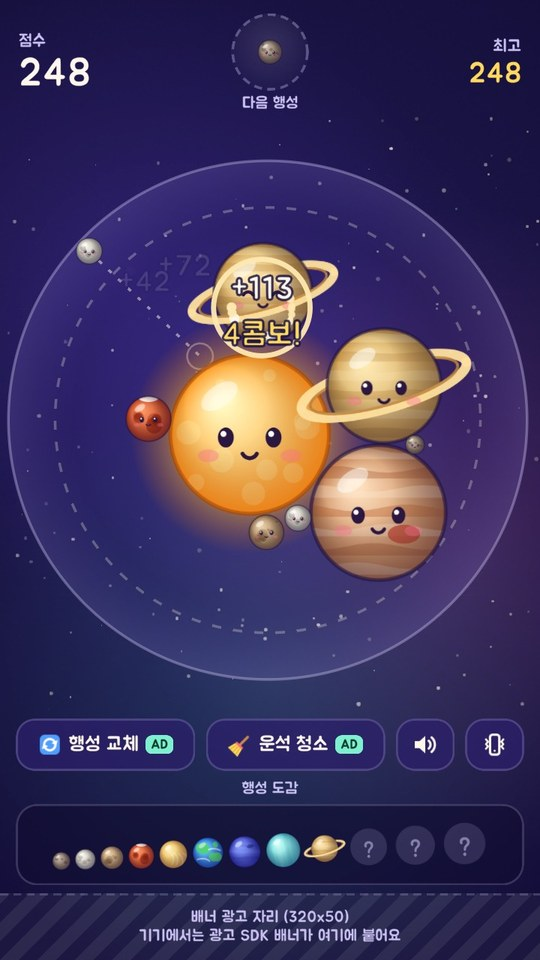
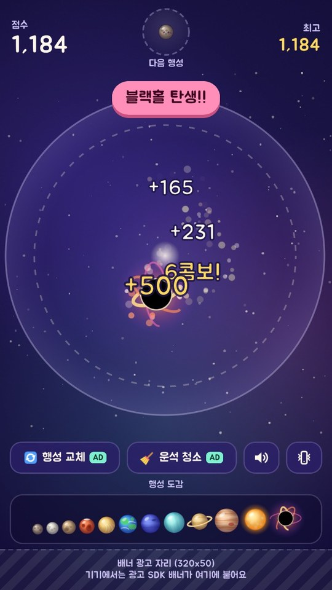
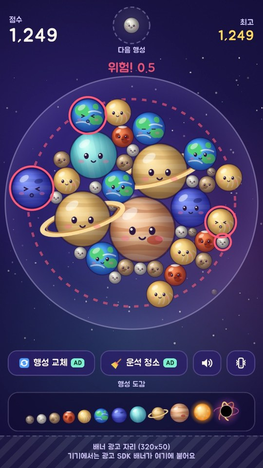
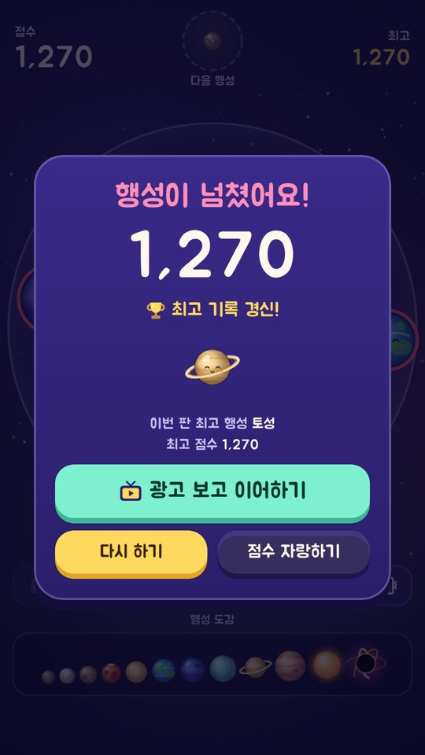
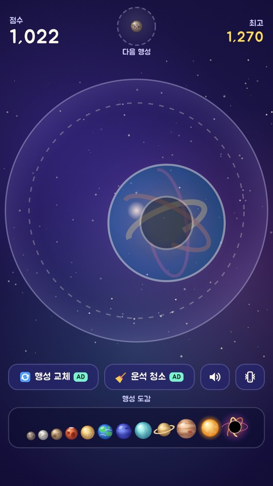
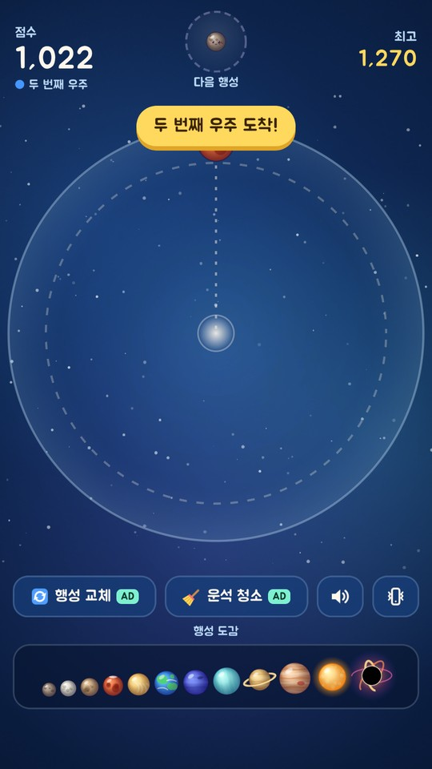
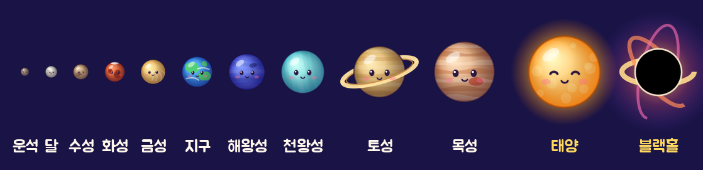

# 블랙홀 만들기

### 행성 하나 쐈을 뿐인데, 우주가 통째로 사라졌다

소리까지 듣고 싶다면 <a href="docs/media/highlight.mp4">고화질 영상 (1080p · 60fps)</a>

 

운석 두 개가 부딪히면 달이 돼요. 달 두 개가 만나면 수성이 되고요.
화성, 금성, 지구를 지나 토성과 목성까지 키우면 드디어 태양이 떠오릅니다.

그런데 태양이 하나 더 생기면 어떻게 될까요?

**두 태양이 만나는 순간 블랙홀이 태어나고, 판 위의 행성을 남김없이 삼켜 버립니다.**

그리고 블랙홀이 사라진 자리에서, 새로운 우주가 열려요.

 

## 엄지 하나면 충분해요

화면을 누른 채 방향을 잡고, 손을 떼면 행성이 날아가요. 조작은 그게 전부예요.

가운데로 끌려 들어간 행성들은 서로 밀치며 빈틈을 파고들고, 같은 행성끼리 닿는 순간 하나로 합쳐집니다.
잘 노린 한 발이 안쪽에서 연쇄 합체를 일으키면 점수가 콤보로 불어나요. 금성 한 발로 태양까지 줄줄이 터지는 날도 있어요.

대신 욕심은 금물. 행성이 점선 밖으로 넘친 채 버티면 그대로 끝이에요.

판이 꽉 막혔다면 지금 행성을 바꾸거나 운석과 달을 한 번에 치워 보세요. 넘쳐 버렸어도 한 판에 한 번은 이어서 할 수 있어요.
최고 기록이 나오면 친구에게 점수를 자랑하는 것도 잊지 말고요.

<table>
  <tr>
    <td align="center"> 시작은 버튼 하나로</td>
    <td align="center"> 같은 행성끼리 쾅, 새 행성 발견</td>
    <td align="center"> 금성 한 발에 5연쇄</td>
  </tr>
  <tr>
    <td align="center"> 태양 + 태양 = 블랙홀</td>
    <td align="center"> 위험! 넘치기 직전</td>
    <td align="center"> 최고 기록 경신</td>
  </tr>
</table>

## 블랙홀 너머엔 또 다른 우주

블랙홀이 판을 다 삼키고 사라지면, 그 자리에서 새 우주가 동그랗게 번져 나와요.
보랏빛 우주 다음엔 깊은 바다, 그다음엔 분홍 성운, 초록 오로라, 노을, 황금빛 밤.
판은 텅 비었지만 점수는 그대로예요. 태양 두 개를 다시 모으면 다음 우주가 기다리고 있어요.

이번 판엔 몇 번째 우주까지 갈 수 있을까요? 가장 멀리 간 우주는 기록으로 남아요.

<table>
  <tr>
    <td align="center"> 블랙홀 자리에서 열리는 새 우주</td>
    <td align="center"> 두 번째 우주 도착!</td>
  </tr>
</table>

## 행성마다 표정이 있어요

눈을 깜빡이고, 합체하면 활짝 웃고, 밖으로 밀려나면 겁에 질린 얼굴이 돼요.
작은 운석부터 이글거리는 태양까지 열한 개의 행성, 그리고 마지막은 블랙홀.
아직 만나지 못한 행성은 도감에 물음표로 남아 있어요. 전부 채워 보세요.

## 곧 만나요

Android와 iOS로 출시를 준비하고 있어요.

 

직접 해 보고 싶다면

 

Unity 6(6000.6.2f1)로 프로젝트를 열고 `Assets/_Game/Scenes/Main.unity`에서 Play를 누르면 바로 할 수 있어요.
PC에서는 마우스로 조준해서 클릭하거나, ←→ 키로 방향을 잡고 스페이스로 쏘면 됩니다.

글꼴 <a href="https://fonts.google.com/specimen/Jua">Jua</a> · SIL Open Font License
